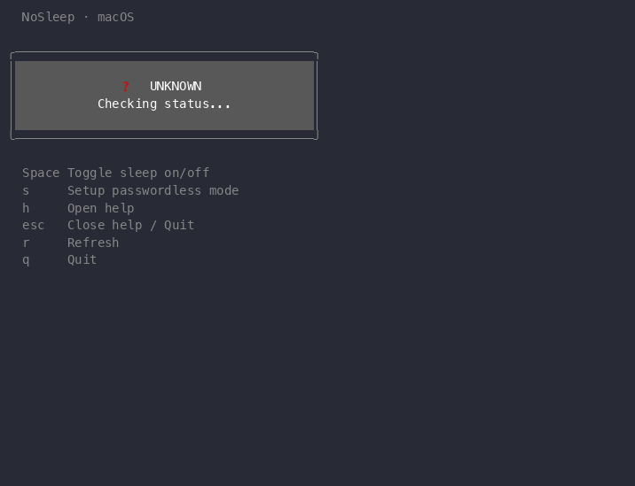
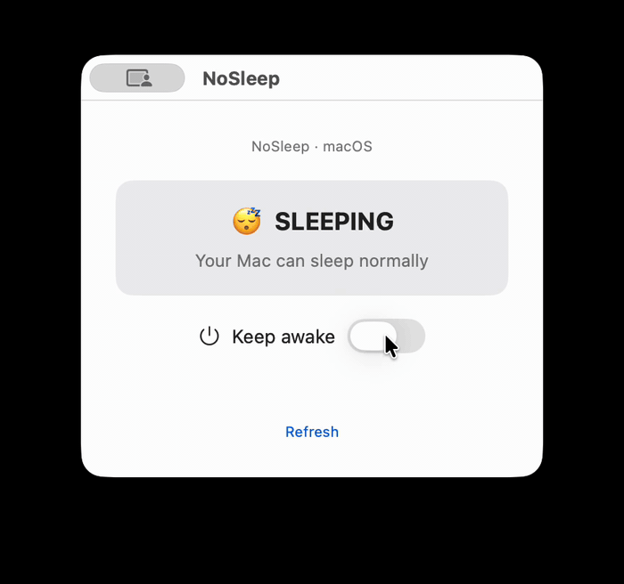

# nosleep

A tiny macOS shell script (with a TUI and a native GUI) for toggling system sleep with `pmset`.

It is intended for cases where you need a system-level sleep toggle, including lid-closed use, rather than a temporary per-process keep-awake command.

## Choose Your Interface

NoSleep ships in a few flavors — pick whichever feels most comfortable:

| Interface | Best for | How to run |
|-----------|----------|------------|
| **Bash script** (`cli/nosleep.sh`) | Minimalists who like one-liners and shell history | `./cli/nosleep.sh on` |
| **TUI dashboard** | People who want a keyboard-driven visual interface | `make run` |
| **TUI Mac app** (`NoSleep-TUI.app`) | The TUI, as a double-clickable app (opens in Terminal) | `make tui-app`, then copy to `/Applications` |
| **Native GUI** | A regular Mac window with a keep-awake toggle | `make gui` |

All of these call into the same `nosleep.sh` under the hood — the TUI and both apps just embed it for convenience, so behavior is identical across them. Pick whichever fits your workflow.

## Usage

```bash
chmod +x cli/nosleep.sh
./cli/nosleep.sh on
./cli/nosleep.sh off
./cli/nosleep.sh status
./cli/nosleep.sh setup
./cli/nosleep.sh help
```

## What It Does

- `on` runs `sudo pmset -a disablesleep 1`
- `off` runs `sudo pmset -a disablesleep 0`
- `status` reads the current `disablesleep` value from `pmset`
- `setup` installs a sudoers rule so `on`/`off` stop asking for a password
- `help` shows the usage message

All commands accept `--json` for machine-readable output:

```bash
./cli/nosleep.sh status --json   # {"state":"awake","disablesleep":1}
./cli/nosleep.sh on --json       # {"ok":true,"action":"on"}
./cli/nosleep.sh off --json      # {"ok":true,"action":"off"}
./cli/nosleep.sh setup --json    # {"ok":true,"action":"setup","user":"yourname"}
```

## Example Scenarios

- Running a long local job or server while the Mac is closed and away from a charger.
- Allowing longer-running work such as app builds, model training, or other compute-heavy tasks to continue while you are in transit or moving between meetings.
- Keeping a remote session, file transfer, or other background task alive when normal sleep would interrupt it.
- Temporarily preventing sleep on a machine used as a small home server, lab machine, or automation host.
- Using a Mac in a setup where `caffeinate` is not sufficient and you intentionally need sleep disabled at the system level.

## How This Differs From `caffeinate`

`caffeinate` is commonly used to keep a Mac awake while a process is running or while the display remains open, but it does not change the underlying system sleep setting in the same way.

This script uses `pmset` to change the system `disablesleep` setting directly. In practice, that means it can continue preventing sleep in situations where `caffeinate` is not the right tool, including lid-closed use and operation on battery power without a charger connected.

## Safety

- This changes a system-level power setting, not just a single terminal session.
- If left enabled, your Mac can remain awake with the lid fully closed and while not connected to power.
- This can increase battery drain and may cause the laptop to become hot, especially if it is placed in a bag or another poorly ventilated space.
- Use it only when you intentionally need this behavior, and run `off` as soon as you are done.

## Notes

- macOS only
- `on` and `off` use `sudo`, so they may prompt for an administrator password
- running the script with no arguments shows the usage message
- `-a` applies the setting to all power profiles

## Optional Install

If you want to call it as `nosleep` from anywhere:

```bash
chmod +x cli/nosleep.sh
sudo ln -s "$(pwd)/cli/nosleep.sh" /usr/local/bin/nosleep
```

This requires administrator access because `/usr/local/bin` is a system directory.

> **Apple Silicon note:** On Apple Silicon Macs, `/usr/local/bin` may not be in your `$PATH` (Homebrew uses `/opt/homebrew/bin` by default). You can either add `/usr/local/bin` to your `PATH`, or symlink into `/opt/homebrew/bin` instead.

## Skip Password Prompts

The easiest way:

```bash
./cli/nosleep.sh setup
```

This creates a sudoers drop-in file for the current user. You'll enter your password once during setup — after that, `on` and `off` work without prompting. In the native GUI, the same step is **Set Up Now**.

You can also do it manually for a single user or an entire group:

```bash
# Allow all admin-group users to run pmset without password
echo "%admin ALL=(ALL) NOPASSWD: /usr/bin/pmset -a disablesleep 0, /usr/bin/pmset -a disablesleep 1" | sudo tee /etc/sudoers.d/nosleep
```

Or limit it to a single user:

```bash
echo "$USER ALL=(ALL) NOPASSWD: /usr/bin/pmset -a disablesleep 0, /usr/bin/pmset -a disablesleep 1" | sudo tee /etc/sudoers.d/nosleep
```

This creates a drop-in file under `/etc/sudoers.d/`, which is safer than editing `/etc/sudoers` directly. The `status` command does not use `sudo`, so it is unaffected.

## Automated Builds

Releases are automatically built and published to GitHub Releases when a new tag is pushed. The workflow builds the CLI script, the TUI binary, the TUI Mac app, and the native GUI.

To create a new release:
1. Create and push a new tag: `git tag v1.2.3`
2. Push the tag: `git push origin v1.2.3`
3. GitHub Actions will automatically build and create a release with the assets (e.g., `nosleep-tui-app-macos.zip`, `nosleep-gui-app-macos.zip`).

## TUI

A terminal UI dashboard for toggling sleep with keyboard shortcuts. The TUI communicates with `nosleep.sh` via the `--json` flag for structured, reliable parsing.

### Build

The easiest way to build the TUI is using `make`:

```bash
make build
```

This will automatically generate the required embedded files and compile a single, self-contained `nosleep-tui` binary at `build/nosleep-tui`.

**Prerequisites:** Go 1.16+ (required for `go:embed`). Install via [go.dev/dl](https://go.dev/dl/) or `brew install go`.

### Run

You can run it directly or with make:

```bash
./build/nosleep-tui
# or
make run
```

### Demo



### Key Bindings

| Key     | Action                        |
|---------|-------------------------------|
| Space   | Toggle sleep on/off           |
| s       | Setup passwordless mode       |
| h       | Open help                     |
| esc     | Close help / Quit             |
| r       | Refresh status                |
| q       | Quit                          |

> **First time?** Press `s` to install the passwordless sudoers rule — otherwise `Space` will prompt for your password each time you toggle.

### TUI Mac App

You can build a `NoSleep-TUI.app` bundle that works like a regular Mac app — double-click to launch, shows up in Spotlight and Launchpad.

```bash
make tui-app
```

This produces `build/NoSleep-TUI.app`. To install, copy it to `/Applications`:

```bash
cp -r build/NoSleep-TUI.app /Applications/
```

> **Per-user install:** If you don't want to copy to the system-wide `/Applications` (which requires admin), you can copy it to `~/Applications` instead — macOS will still pick it up for Launchpad and Spotlight. Create the folder first with `mkdir -p ~/Applications` if it doesn't exist.

The app opens Terminal.app and runs the TUI inside it. The binary is fully self-contained — no external files or repo checkout needed.

**Gatekeeper note:** The bundle is ad-hoc signed, which works on the machine that built it. On other machines, macOS may block the app on first launch. To allow it, run:

```bash
xattr -cr NoSleep-TUI.app
```

## Native GUI

A small SwiftUI window that talks to the same `nosleep.sh` script. Use this if you want a regular Mac app instead of a terminal dashboard.

### Demo



### Build

You need [Xcode](https://developer.apple.com/xcode/) and [XcodeGen](https://github.com/yonaskolb/XcodeGen) (`brew install xcodegen` if you don't have it). macOS 14 or later.

```bash
make gui
```

This produces `build/NoSleep-GUI.app` (kept separate from the TUI's `build/NoSleep-TUI.app`). To install, copy it to `/Applications`:

```bash
cp -r build/NoSleep-GUI.app /Applications/
```

Or open the generated project in Xcode:

```bash
cd NoSleep-GUI
xcodegen generate
open NoSleepGUI.xcodeproj
```

### Run

```bash
make run-gui
```

The app is unsandboxed on purpose — it has to read `/etc/sudoers.d/nosleep` and run `sudo pmset`.

**Gatekeeper note:** The bundle is ad-hoc signed, which works on the machine that built it. On other machines, macOS may block the app on first launch. To allow it, run:

```bash
xattr -cr NoSleep-GUI.app
```

### How to use

1. If you see **Setup Required**, click **Set Up Now** and enter your Mac admin password. That installs the same passwordless sudoers rule as `./cli/nosleep.sh setup`.
2. Use the **Keep awake** switch to turn sleep off and on.
3. Click **Refresh** if you changed the setting from the CLI or TUI and want the window to catch up. Status also refreshes on its own every few seconds.

The orange **Battery drain risk** note appears while sleep is disabled — turn the switch off when you are done.
